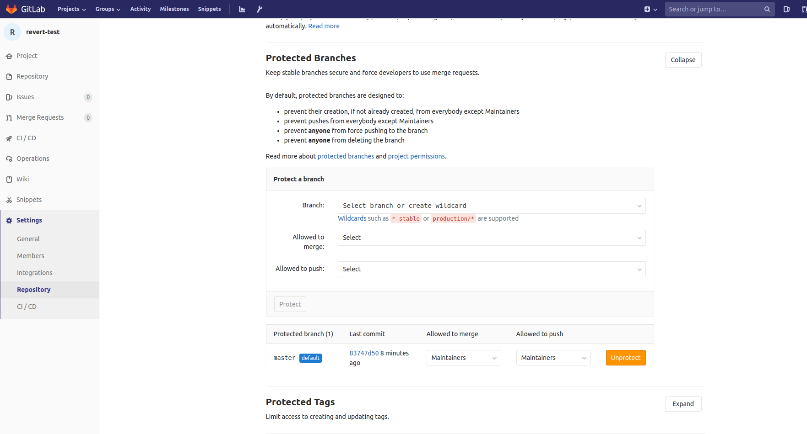

### How to revert to a tag with git

This assumes you are on the master branch.  This will reset the local master
to whatever 4.1.4 was.

```
git reset --hard 4.1.4
```

Gitlab will protect the master branch from a force push.  You have to go into Gitlab for the repo
and remove the protection on the master branch.




Now you can force the push to git.

```
git push origin master --force
```

The master branch should now be back to whatever tag 4.1.4 looked like.

All of the more recent tags are still there, for example 5.1.0 should still be there.  You could even roll forward to
tag 5.1.0 for example with the reset --hard command.

You should re-add the protection of the master branch in Gitlab once again.


### This was some random stuff.

